# 🐳 Virtualization with Docker
## Modularization and Containerization of a Concurrent TCP Web Server

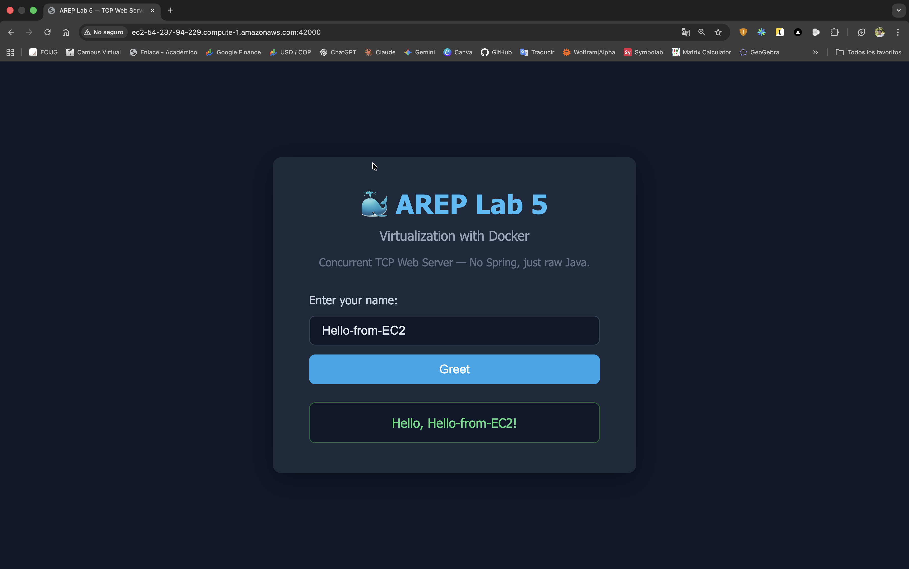

[](https://www.oracle.com/java/)
[](https://maven.apache.org/)
[](https://www.docker.com/)
[](https://aws.amazon.com/ec2/)
[](LICENSE)

> **Enterprise Architecture (AREP)** — Laboratory 5  
> Building and deploying a concurrent TCP web server using a custom Java framework — no Spring — containerized with **Docker** and deployed on **AWS EC2**.

---

## 📋 **Table of Contents**

- [Overview](#-overview)
- [Project Structure](#-project-structure)
- [Architecture](#-architecture)
- [Class Design](#-class-design)
- [Getting Started](#-getting-started)
- [Docker Deployment](#-docker-deployment)
- [AWS EC2 Deployment](#-aws-ec2-deployment)
- [Results](#-results)
- [Author](#-author)
- [License](#-license)
- [Additional Resources](#-additional-resources)

---

## 🌐 **Overview**

This laboratory explores **modularization through virtualization**, implementing a lightweight concurrent HTTP server in raw Java and packaging it as a **Docker container** for deployment on **AWS EC2**. The key goals are:

- ✅ **Custom framework**: No Spring — pure Java TCP server with thread-pool concurrency
- ✅ **Graceful shutdown**: JVM shutdown hook ensures in-flight requests complete before termination
- ✅ **Static file serving**: HTML, CSS, JS, and binary resources from classpath
- ✅ **REST API**: JSON endpoint at `/api/greeting`
- ✅ **Containerization**: Multi-instance Docker deployment via `docker run` and `docker-compose`
- ✅ **Cloud deployment**: Image published to **DockerHub** and pulled to an **AWS EC2** instance

### Technologies

| Layer | Technology |
|-------|-----------|
| **Language** | Java 17 |
| **Build** | Apache Maven 3.9 |
| **Logging** | SLF4J + Logback |
| **Serialization** | Gson 2.10 |
| **Containerization** | Docker 27 / Docker Compose |
| **Registry** | DockerHub |
| **Cloud** | AWS EC2 (Amazon Linux 2023) |

---

## 📁 **Project Structure**

```
AREP-laboratory-5-virtualization-with-docker/
│
├── src/
│   └── main/
│       ├── java/
│       │   └── edu/eci/arep/
│       │       ├── app/
│       │       │   └── TcpWebServerApp.java        ← Entry point & shutdown hook
│       │       ├── controller/
│       │       │   └── GreetingController.java      ← REST endpoint logic
│       │       └── server/
│       │           ├── TcpWebServer.java            ← Concurrent server core
│       │           ├── ClientHandler.java           ← Per-request thread worker
│       │           ├── HttpRequest.java             ← HTTP request parser
│       │           └── HttpResponse.java            ← HTTP response builder
│       └── resources/
│           └── webroot/
│               ├── index.html                       ← Frontend UI
│               ├── styles.css
│               └── app.js
│
├── assets/
│   └── images/                                      ← README screenshots
│
├── Dockerfile
├── docker-compose.yml
├── pom.xml
├── LICENSE
└── README.md
```

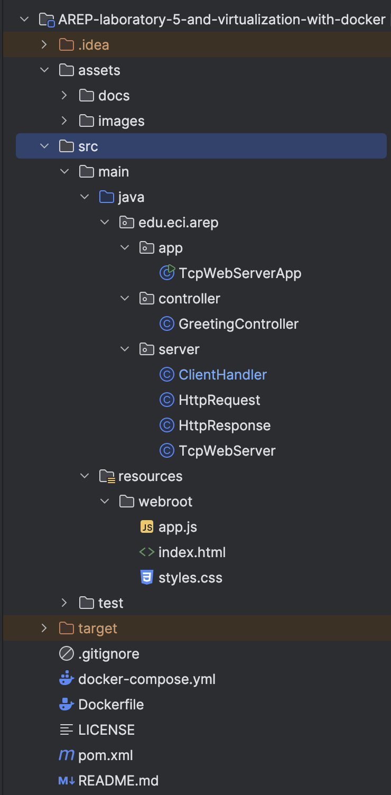

*Project structure as seen in IntelliJ IDEA — `src/main/java` marked as Sources Root, `src/main/resources` as Resources Root.*

---

## 🏛️ **Architecture**

The server follows a classic **thread-pool concurrency model**: a single accept loop dispatches each incoming TCP connection to a fixed-size `ExecutorService`, isolating request handling from the main thread.

```
Browser / Client
       │
       ▼  TCP :8080
┌─────────────────────┐
│    TcpWebServer     │  ← ServerSocket accept loop
│  (main thread)      │
└────────┬────────────┘
         │  submit(ClientHandler)
         ▼
┌────────────────────────┐
│   ExecutorService      │  ← Fixed thread pool (10 threads)
│  pool-1-thread-[1…10]  │
└────────┬───────────────┘
         │
   ┌─────┴───────┐
   ▼             ▼
/api/*      Static files
   │             │
GreetingCtrl  webroot/
   │
JSON response
```

**Graceful shutdown** is implemented via `Runtime.getRuntime().addShutdownHook(...)`, which calls `TcpWebServer.stop()` on SIGTERM — closes the `ServerSocket`, shuts down the thread pool, and waits up to 30 seconds for in-flight requests to complete.

---

## 🗂️ **Class Design**

| Class | Package | Responsibility |
|-------|---------|---------------|
| `TcpWebServerApp` | `app` | Entry point; resolves `PORT` env variable; registers shutdown hook |
| `TcpWebServer` | `server` | Opens `ServerSocket`; accept loop; thread-pool management; graceful stop |
| `ClientHandler` | `server` | `Runnable` worker; routes requests to API or static file resolver |
| `HttpRequest` | `server` | Parses request line, headers, query parameters, and body |
| `HttpResponse` | `server` | Builds well-formed HTTP/1.1 response strings (200, 404, 500) |
| `GreetingController` | `controller` | Returns a JSON greeting message for a given name |

---

## 🚀 **Getting Started**

### Prerequisites

- **Java 17+**
- **Apache Maven 3.9+**
- **Docker Desktop** (for local container testing)

### 1. Clone the repository

```bash
git clone https://github.com/JAPV-X2612/AREP-laboratory-5-virtualization-with-docker.git
cd AREP-laboratory-5-virtualization-with-docker
```

### 2. Build the project

```bash
mvn clean package
```

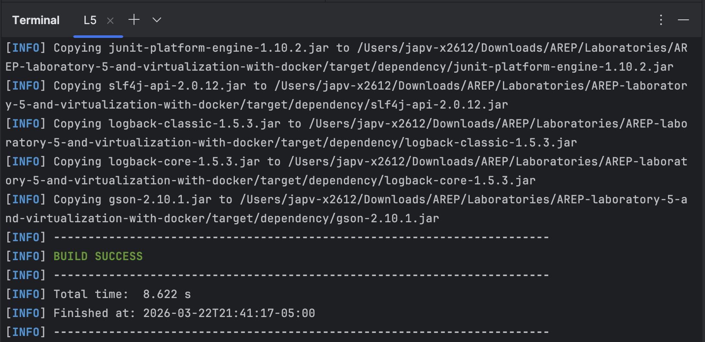

*`BUILD SUCCESS` — compiled classes and all runtime dependencies copied to `target/dependency/`.*

### 3. Run locally

```bash
java -cp "target/classes:target/dependency/*" edu.eci.arep.app.TcpWebServerApp
```

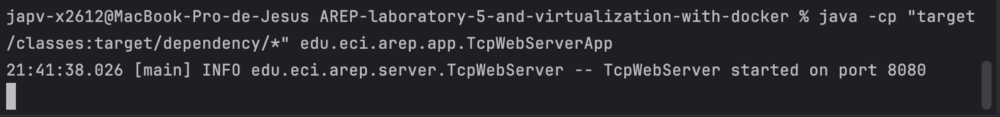

*Server started and listening on port `8080`.*

### 4. Test in browser

Navigate to `http://localhost:8080` to access the web UI:

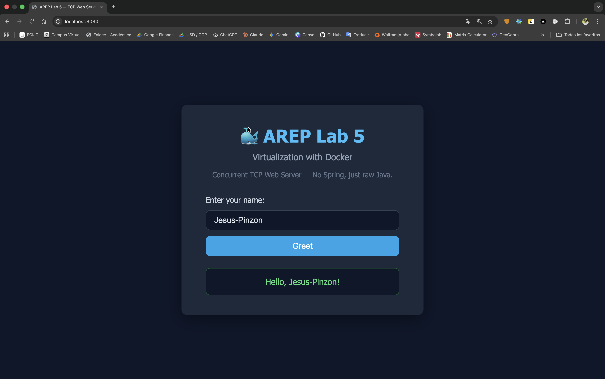

*Interactive greeting form served as a static file from `webroot/`.*

Access the REST endpoint directly:

```
http://localhost:8080/api/greeting?name=AREP
```

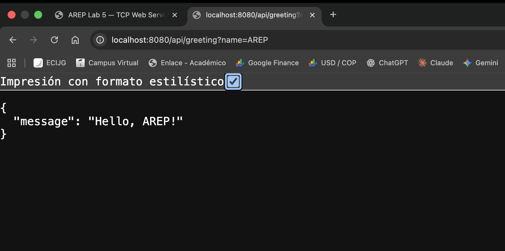

*JSON response from the `GreetingController`.*

### 5. Verify concurrency

Each request is handled by a separate thread from the pool. The terminal output confirms multiple `pool-1-thread-N` workers processing requests in parallel:

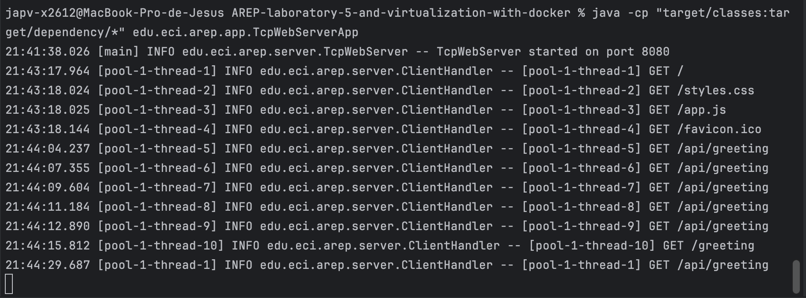

*Ten distinct pool threads handling concurrent connections.*

---

## 🐳 **Docker Deployment**

### Build the Docker image

```bash
docker build --tag arep-lab5-tcp-web-server .
```

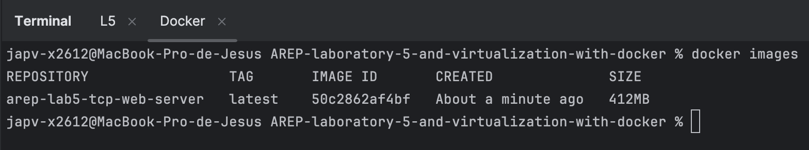

*Image `arep-lab5-tcp-web-server:latest` (412 MB) built successfully.*

### Run three independent containers

```bash
docker run -d -p 34000:8080 --name tcpfirstdockercontainer1 arep-lab5-tcp-web-server
docker run -d -p 34001:8080 --name tcpfirstdockercontainer2 arep-lab5-tcp-web-server
docker run -d -p 34002:8080 --name tcpfirstdockercontainer3 arep-lab5-tcp-web-server
docker ps
```

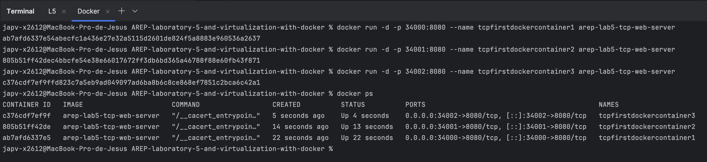

*All three containers running simultaneously, each mapping a distinct host port to the internal `8080`.*

Verify one of the containers via browser:

```
http://localhost:34000/api/greeting?name=Docker
```

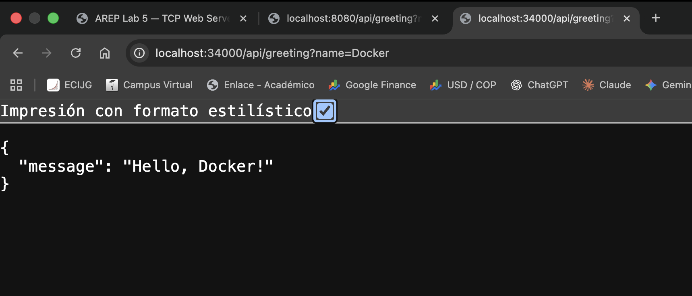

### Run with Docker Compose

```bash
docker-compose up -d
docker ps
```

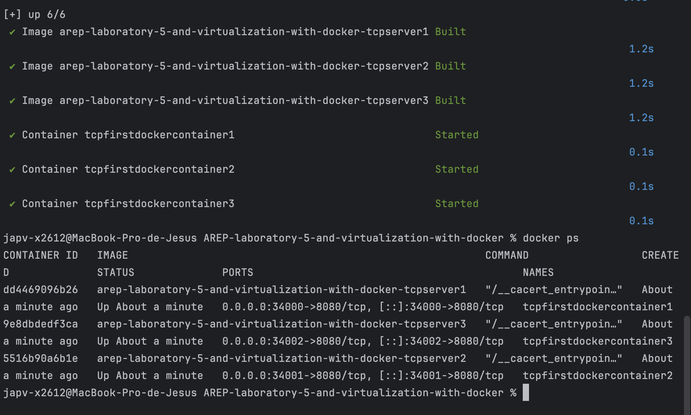

*`docker-compose` builds and starts all three services (`tcpfirstdockercontainer1/2/3`) in a single command.*

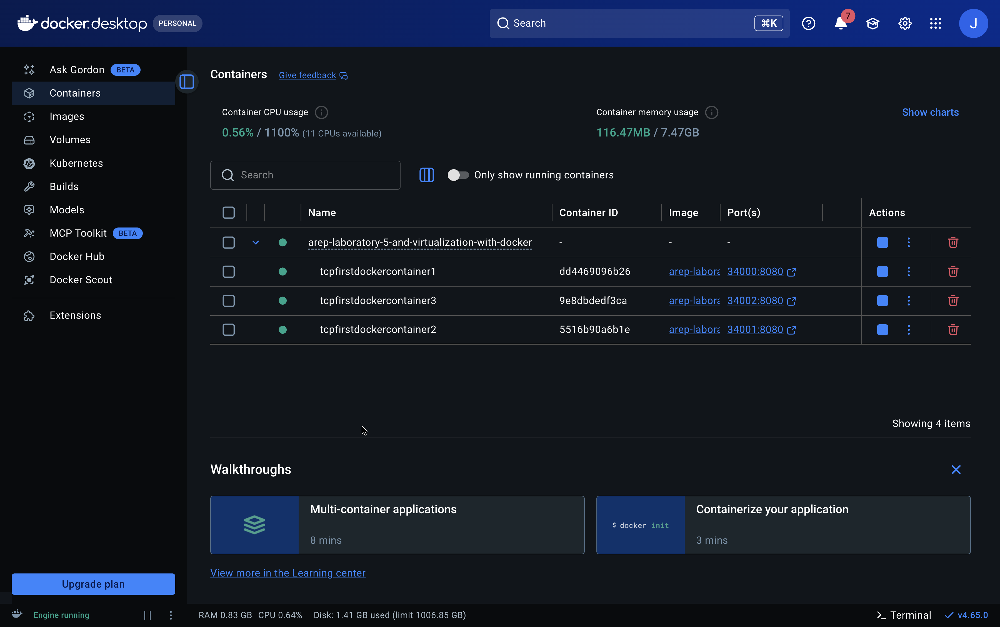

*Docker Desktop showing the three running containers grouped under the Compose stack.*

### Publish to DockerHub

```bash
docker tag arep-lab5-tcp-web-server japv2612/arep-lab5-tcp-web-server:latest
docker login
docker push japv2612/arep-lab5-tcp-web-server:latest
```

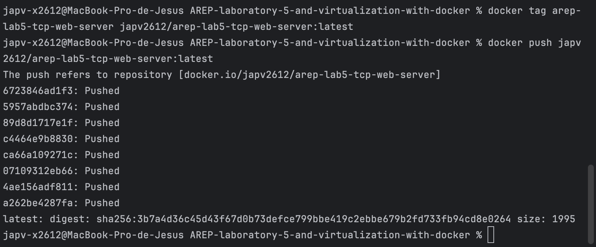

*All image layers pushed successfully to `docker.io/japv2612/arep-lab5-tcp-web-server`.*

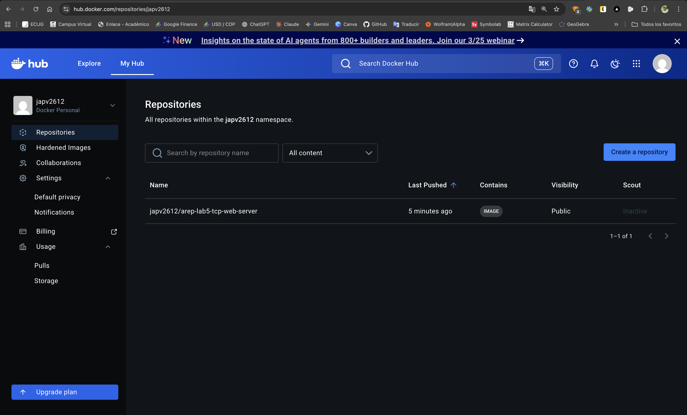

*Public repository `japv2612/arep-lab5-tcp-web-server` visible in DockerHub under the `japv2612` namespace.*

> **Note:** The image was built on an Apple Silicon (ARM64) machine. For AMD64 targets such as AWS EC2, rebuild for the correct platform:
> ```bash
> docker buildx build --platform linux/amd64 \
>   --tag japv2612/arep-lab5-tcp-web-server:latest \
>   --push .
> ```

---

## ☁️ **AWS EC2 Deployment**

### 1. Launch EC2 instance

Create an **Amazon Linux 2023** EC2 instance. The instance used in this laboratory is:

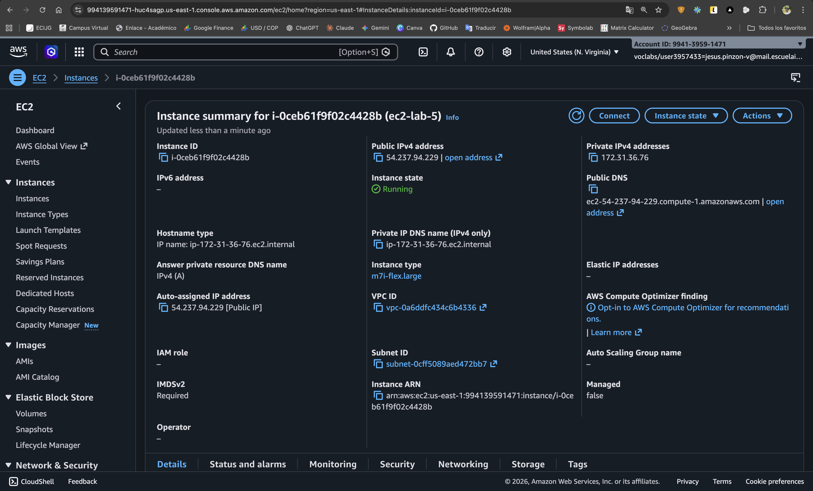

*Instance `ec2-lab-5` running at `ec2-54-237-94-229.compute-1.amazonaws.com` (public DNS), state: **Running**.*

### 2. Configure Security Group inbound rules

Open the required ports in the instance's Security Group:

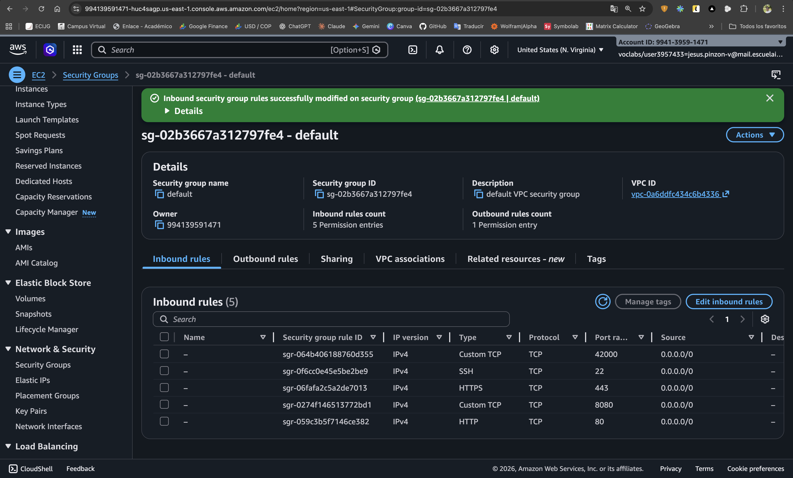

| Port | Protocol | Purpose |
|------|----------|---------|
| `22` | TCP | SSH access |
| `80` | TCP | HTTP |
| `443` | TCP | HTTPS |
| `8080` | TCP | Direct server access |
| `42000` | TCP | Docker container mapping |

### 3. Install Docker and deploy

Connect via SSH and run:

```bash
sudo yum update -y
sudo dnf install docker -y
sudo service docker start
sudo usermod -a -G docker ec2-user
# Disconnect and reconnect for group changes to take effect
docker pull japv2612/arep-lab5-tcp-web-server:latest
docker run -d -p 42000:8080 --name tcpfirstdockercontaineraws japv2612/arep-lab5-tcp-web-server
```

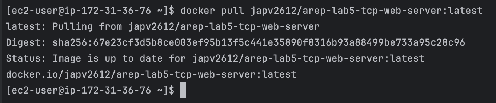

*Image pulled from DockerHub onto the EC2 instance.*

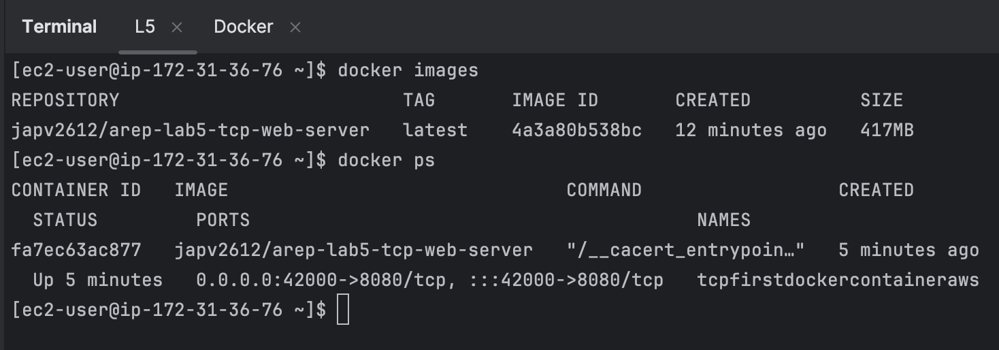

*Container `tcpfirstdockercontaineraws` running on EC2, mapping port `42000 → 8080`.*

### 4. Verify deployment

**REST endpoint on AWS:**

```
http://ec2-54-237-94-229.compute-1.amazonaws.com:42000/api/greeting?name=AWS
```

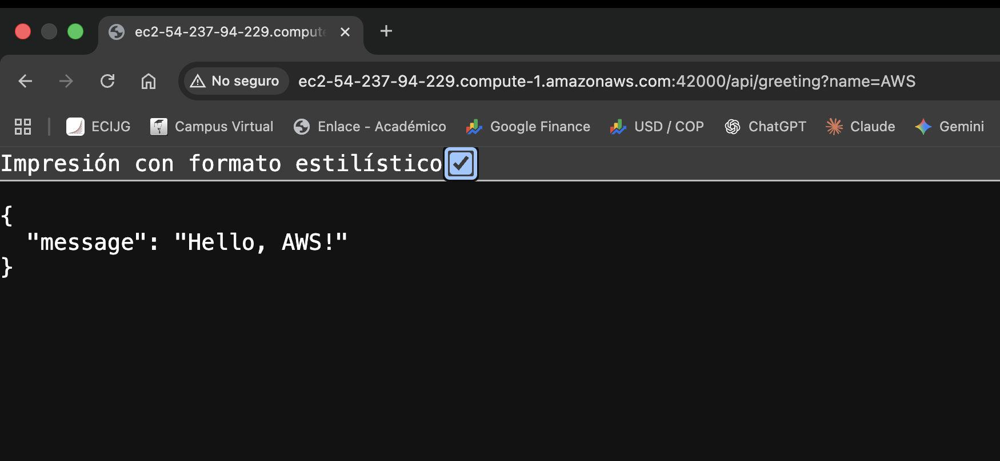

*JSON response `{"message": "Hello, AWS!"}` served from the containerized server running on EC2.*

**Frontend UI on AWS:**

```
http://ec2-54-237-94-229.compute-1.amazonaws.com:42000
```


*Complete web application fully operational on AWS EC2 — the static frontend communicates with the REST API, all running inside a Docker container.*

---

## 🎯 **Results**

### Key Takeaways

- **Concurrency** is achieved through a fixed thread pool (`ExecutorService`) — the server handles up to 10 simultaneous connections without blocking the accept loop.
- **Graceful shutdown** via JVM shutdown hooks ensures no abrupt connection drops on SIGTERM.
- **Portability**: the same Docker image runs identically on a local MacBook (ARM64, via emulation) and on AWS EC2 (AMD64). A multi-platform build with `docker buildx` eliminates the architecture mismatch entirely.
- **Docker Compose** reduces multi-container orchestration to a single command, mirroring how production environments manage service stacks.
- **DockerHub** as a public registry makes image distribution to any cloud instance trivial — no artifact transfer needed.

---

## 👥 **Author**

<table>
  <tr>
    <td align="center">
      <a href="https://github.com/JAPV-X2612">
        
        <br />
        <sub><b>Jesús Alfonso Pinzón Vega</b></sub>
      </a>
      <br />
      <sub>Full Stack Developer</sub>
    </td>
  </tr>
</table>

---

## 📄 **License**

This project is licensed under the **Apache License, Version 2.0** — see the [LICENSE](LICENSE) file for details.

---

## 🔗 **Additional Resources**

### Docker
- [Docker Official Documentation](https://docs.docker.com/)
- [Dockerfile Reference](https://docs.docker.com/engine/reference/builder/)
- [Docker Compose File Reference](https://docs.docker.com/compose/compose-file/)
- [DockerHub — japv2612/arep-lab5-tcp-web-server](https://hub.docker.com/r/japv2612/arep-lab5-tcp-web-server)

### Java Concurrency
- [Java ExecutorService — Oracle Docs](https://docs.oracle.com/en/java/docs/api/java.base/java/util/concurrent/ExecutorService.html)
- [Java ServerSocket — Oracle Docs](https://docs.oracle.com/en/java/docs/api/java.base/java/net/ServerSocket.html)
- [Java Shutdown Hooks](https://docs.oracle.com/javase/8/docs/api/java/lang/Runtime.html#addShutdownHook-java.lang.Thread-)

### AWS
- [Amazon EC2 Documentation](https://docs.aws.amazon.com/ec2/)
- [AWS Security Groups](https://docs.aws.amazon.com/vpc/latest/userguide/vpc-security-groups.html)
- [Installing Docker on Amazon Linux 2023](https://docs.aws.amazon.com/serverless-application-model/latest/developerguide/install-docker.html)

### Course Reference
- [AREP — Enterprise Architecture, Escuela Colombiana de Ingeniería Julio Garavito](https://campusvirtual.escuelaing.edu.co/)

---

⭐ *If you found this project helpful, please consider giving it a star!* ⭐
